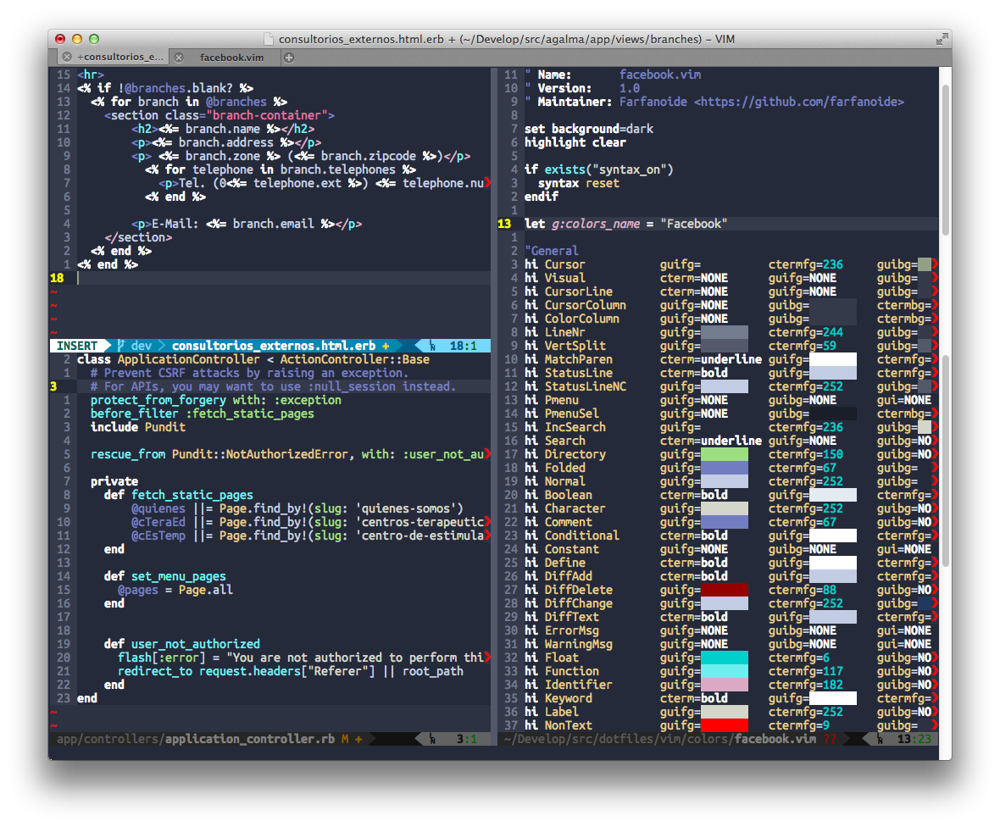
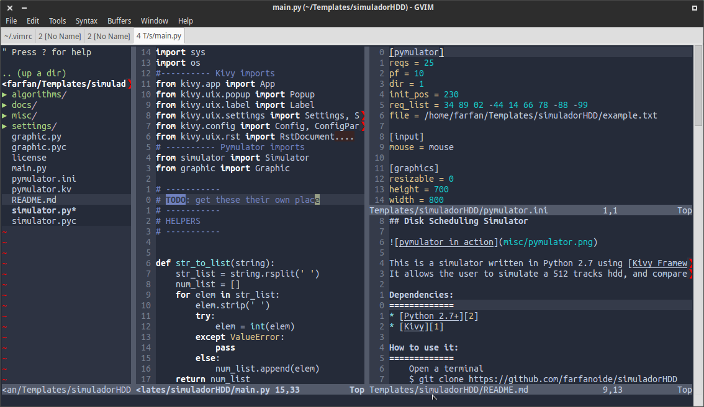

Facebook Colour Scheme for vim
==============================

This is a very simple port of the Facebook Color Scheme for Sublime Text which
you can find [here][] Original Sublimem Color Scheme [here][], all credits to
[mbixby][].

Screenshots:
------------

MacVim:



GVim:



Installation:
-------------

Probably any plugin manager will work. Then set `colorscheme facebook` on your
vimrc.

With [vim-plug][vim-plug]:

```vim
Plug 'farfanoide/vim-facebook'
```

With [Vundle][vundle]:

```vim
Plugin 'farfanoide/vim-facebook'
```

With [dein][dein]:

```vim
call dein#add('farfanoide/vim-facebook')
```


Thanks:
-------

- [mbixby][] original theme author
- [sickill][] for the coloration utility.
- [shawncplus][] for the vim-toCterm utility.

Contributing:
--------------

1. Fork it
2. Create your feature branch (`git checkout -b my-new-feature`)
3. Commit your changes (`git commit -am 'Add some feature'`)
4. Push to the branch (`git push origin my-new-feature`)
5. Create a new Pull Request

<!-- links -->
[mbixby]: https://github.com/mbixby
[here]: https://github.com/mbixby/facebook-color-scheme
[sickill]: https://github.com/sickill/coloration
[shawncplus]: http://github.com/shawncplus/Vim-toCterm

